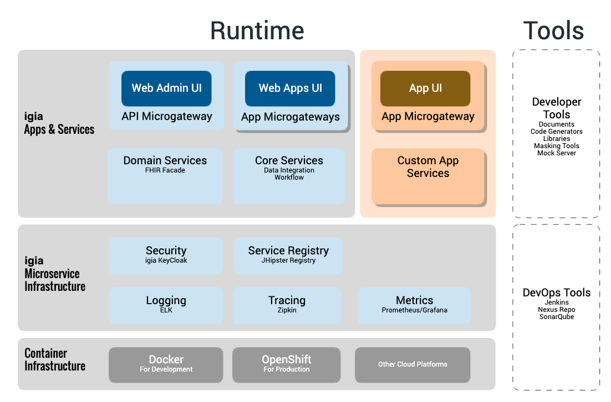
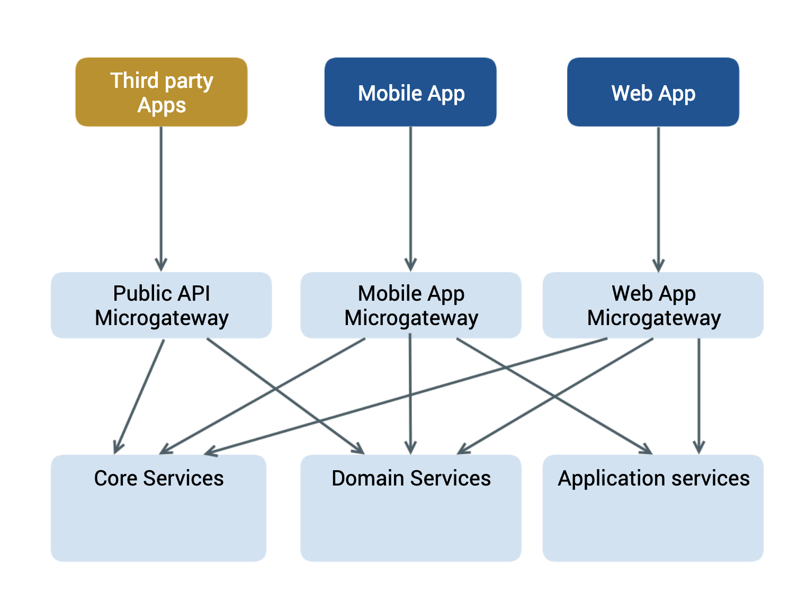

## Overview

As stated in the [Platform Overview](platformoverview.md), <igia/> aims to reduce the cost and effort associated with producing robust clinical applications. <igia/> is designed to be an enterprise grade platform that clinical applications can be developed and deployed upon. To achieve such a goal, we leverage many state of the art enterprise application design patterns and other open source software solutions.

Technically, <igia/> is developed using a microservice architecture, leveraging container technology for deployment.

### Microservice Architecture

<igia/> is developed using the [Microservice Architecture](https://microservices.io/patterns/microservices.html) pattern. To create a platform for developing scalable enterprise grade clinical applications, <igia/> implements its microservice architecture using [Spring Cloud Netflix](https://spring.io/projects/spring-cloud-netflix) and relies heavily on [JHipster](https://www.jhipster.tech/microservices-architecture/) to generate key components.

### Container based deployment

Microservices and containers go well together, and <igia/> leverages container technology for deployment. <igia/> is cloud platform agnostic and can be deployed on various private/public/hybrid cloud environments.

### SMART on FHIR

<igia/> also supports the [SMART Application Launch Framework, aka SMART on FHIR](http://www.hl7.org/fhir/smart-app-launch/).

## Architecture Diagrams

## Core Components

The following is a quick summary of some of the key <igia/> components:

### Microservice Registry

[JHipster registry](https://www.jhipster.tech/jhipster-registry/) is the microservice registry for the <igia/> platform. It comes directly from JHipster and contains the following sub-components:

* Eureka server that contains a list of all the services, their instances, and their locations
* Spring Cloud Config server that provides runtime configurations to all services
* Runtime monitoring dashboard to monitor and manage all services

Each <igia/> service component (microservice or gateway) will:

* Register itself to Eureka server
* Get configuration from the Spring Cloud Config server

### Identity and Access Management Server

[KeyCloak](https://www.keycloak.org/) is an OAuth2 and OpenID Connect server that serves as the Identity and Access Management server for the <igia/> platform.

<igia/> also enhances KeyCloak to provide [SMART App Launch Framework](http://hl7.org/fhir/smart-app-launch/) support when used with an <igia/> FHIR server.

### Microgateways

In the <igia/> architecture, microgateways are the interface between a frontend app and the microservices. When creating a clinical application, <igia/> recommends the [Backends For Frontends](https://samnewman.io/patterns/architectural/bff/) design pattern. Each clinical application should have its own application microgateway. The JHipster generated gateway app serves this purpose very well.

<igia/> provides a default public API microgateway that provides API access for third party applications. SMART on FHIR applications access FHIR API via this public API microgateway.

The BFF+Gateway pattern is illustrated in the following diagram:

>It is worth noting that a microgateway is not an enterprise grade edge gateway. <igia/> should be deployed in a PaaS system like Kubernetes or OpenShift on a private/public cloud, and relies on PaaS to provide many of the edge service features like TLS termination, DNS, etc.

#### Application microgateway

An application microgateway usually:

* Hosts the Web Application (e.g. Angular or React app)
* Provides server-side security for the Web Application and acts as a confidential client in the [OAuth 2.0 Authorization Framework](https://tools.ietf.org/html/rfc6749#section-2.1).
* Provides HIPAA auditing for the application

#### API microgateway

The <igia/> API microgateway is a special microgateway to provide limited general purpose API access. It provides the following major functions:

* Automatically proxies HTTP requests to all microservices utilizing Netflix Zuul
* Load balances HTTP requests using Netflix Ribbon
* Provide a circuit breaker using Netflix Hystrix
* Enforces rate limiting using Bucket4j
* Enforces any app access control policies

>The <igia/> API microgateway is NOT designed to be an enterprise grade API gateway system that provides full API lifecycle development, integration and management features. For an enterprise edge API gateway, there are several open source solutions such as WSO2 API manager, API Umbrella, as well as other commercial solutions. If desired, a deployment could have an enterprise edge API gateway in front of the <igia/> microgateways.

### Sample FHIR server

<igia/> provides a sample FHIR server with SMART-on-FHIR support. This is a microservice that demonstrates the platform FHIR and SMART libraries and includes the following capabilities:

* A skeleton FHIR server that wraps existing data services, based on the HAPI FHIR library
* SMART-on-FHIR support, based on the HSPC SMART on FHIR library
  * FHIR capability statement enhancements
  * SMART scope enforcement for data access

## Deployment

<igia/> comes with deployment pipelines to deploy an application to:

* Docker server (local development)
* OpenShift (large applications)

Since <igia/> is based on JHipster, it can be deployed to other private/public cloud service like Kubernetes, Azure, AWS, Google Cloud Platform, etc. Please refer to [Using JHipster in production](https://www.jhipster.tech/production/) for detailed information.

## Monitoring, Tracing and Metrics

One key challenge in a microservice architecture is observability since it is a distributed system. <igia/> provide observability via:

* Logging and Monitoring - ELK
* Tracing - Zipkin
* Metrics - Prometheus/Grafana

## Developing new applications and microservices

### Java Microservice development

JHipster provides a code generator for generating crosscutting code to register a Spring Boot app as a microservice on the JHipster Registry. This is a good solution for Java based microservices and applications.

### Non-Java microservices (Polyglot)

Developers can choose other popular technology stacks to develop microservices. The key functionality is to register the microservice with the Eureka server in the JHipster Registry so that the microservice can be discovered and consumed. <igia/> provides limited support for the following stacks:

* `dotnet` core - Eureka service registration using [Steeltoe](https://steeltoe.io/)
* Node.js - Eureka service registration using [eureka-js-client](https://www.npmjs.com/package/eureka-js-client)

<igia/> does not provide code generators for non-Java microservices, so developers need to create a web application using their selected tech stack and framework, then add a eureka client to register the web application as a microservice.

The Spring Cloud project provides an example which can be used to integrate almost any type of service into the microservice ecosystem: [Spring Cloud Netflix](https://github.com/spring-cloud/spring-cloud-netflix/tree/master/spring-cloud-netflix-sidecar).

For `dotnet` core, the [NuGet Microservice Template project](https://www.nuget.org/packages/partners_igia_microservice_template/). Source code for the project is on [GitHub](https://github.com/nicholas-barboutis/partners_igia_microservice_template) provides code generation that supports Eureka registration and Spring Cloud Config integration.  The NuGet template is available as `partners_igia_microservice_template`.

### Application Microgateway development

JHipster provides a code generator to generate a secure Spring Boot based web application that serves as application microgateway.

## Roadmap

### Microservice architecture

<igia/>'s current microservice implementation is based on Spring Cloud Netflix. The key character of this implementation is that the microservice patterns are implemented at the platform level, rather than at the infrastructure level. This gives the platform the advantage of being able to deploy to different PaaS environments such as OpenShift, CloudFountry, AWS, Azure, etc, as long as the container is supported.

With the advance of container orchestration tools like Kubernetes, and service mesh technologies like Istio, some of the microservice patterns can be implemented using the features in the infrastructure layer. The <igia/> team is evaluating these technologies.
