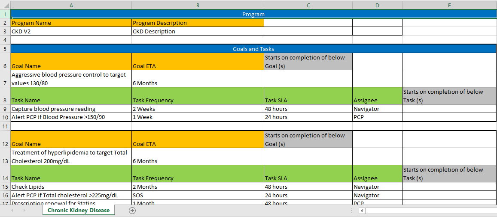

<!-- BEGIN adding docusaurus links -->

The Care Management component is a set of APIs which allows program managers to configure care plans based on stage and risk of disease. <br>

<button onclick="window.location.href='/docs/caremanagement~ACKNOWLEDGEMENTS'">Acknowledgements</button>
<!-- END adding docusaurus links -->

# Care Management

## Introduction
Care coordination and management involves a set of clinical users and a set of assigned tasks. Typically, these tasks need to be triggered in an _asynchronous_ manner and consist of activities that clinical users have to conduct (e.g., talk to the patient, refer to a specialist, call pharmacist). The workflow needed to coordinate and orchestrate these activities is referred to as case management, as compared to typical business process management. Case management often makes use of decision tables to selectively change the sequence of the tasks or optionally add/remove other tasks from the case.

Care management component is a set of APIs which allows program manager to configure care plans based on stage and risk of disease. A Program Manager can identify disease, define rule for segmenting patient into disease & risk category, define clinical and non-clinical actors who manage patient care, define clinical goals for different patient parameters,  configure matching tasks for each actor and goal, define chronology & frequency of the tasks and execute care management in a seamless manner. Care plan can be configured in a simple excel and imported, making it scalable to use this API suite across a spectrum of diseases.

Case management is defined by standards bodies using the CMMN standards. (Decision tables are defined by the DMN standard.)

Case management has levels of maturity starting from _base level_ case management to _dynamic_ (selecting tasks based on decision logic) to _adaptive_ (making use of similar cases or experience of other care managers to adapt to the particular case execution) to _knowledge-driven_ (extracting or augmenting case execution with knowledge based on experience/past data).

## Use Cases
1. Using the CMMN-based case management solution, create an interface for care management consisting of:
    - Care Plan
    - Goals
    - Tasks
    - Task lists (To do, Complete)

2. Create a care plan based on excel template definition of goals, tasks, SLAs
3. Deploy a care plan and allow user interaction via UI/APIs
4. Provide functionality/APIs for care plan management
    - Create template goal
    - Create template case (CHF, CKD, diabetes, HTN, bariatric)
    - Create care plan (case) from template and assign to patient
    - Create goal (as per template) and assign to care plan
    - Create task as per template and add to goal
    - Add custom task to goal


## Usage
This application was generated using JHipster 5.4.2. You can find documentation and help at [https://www.jhipster.tech/documentation-archive/v5.4.2](https://www.jhipster.tech/documentation-archive/v5.4.2).

This is a _microservice_ application intended to be part of a microservice architecture, please refer to the [Doing microservices with JHipster][] page of the documentation for more information.

This application is configured for Service Discovery and Configuration with the JHipster-Registry. On launch, it will refuse to start if it is not able to connect to the JHipster-Registry at [http://localhost:8761](http://localhost:8761). For more information, read our documentation on [Service Discovery and Configuration with the JHipster-Registry][].

### Prerequisites
Following components should be running to start the application:
* PostgreSQL Database

This service uses postgres database. 

To run in dev / production mode 
  * Database must be created in postgres.
  * Username and password should be updated in application-dev.yml/application-prod.yml file for the above database. 

    Example:
 
	    spring
		    database
			    url: jdbc:postgresql://hostname:<port>/<databasename>
			    username: username
			    password: password
* Keycloak Server
* Jhipster-Registry service
* Jhipster-Gateway service (optional)
* Camunda Server

Please refer to documentation @ https://camunda.com/download/

### Configuration

### Camunda Keycloak Integration Configuration (optional)
Camunda REST APIs can be secured by having integration with Keycloak

Please refer to keycloak documentation @ https://www.keycloak.org/docs/latest/securing_apps/index.html#_servlet_filter_adapter

For reference configuration, please refer to documentation @ https://github.com/igia/igia-camunda.git 

### Application Configuration
#### Application Specific Properties
Following application specific properties should be added in application.yml file :

* default-task-sla

It refers to the default value in hours for the human task sla. The default value is applied when the sla is not defined for the human task in the program excel.

    Example:
 
        application:
            default-task-sla: 24
	    
#### Hystrix Configuration
When using execution isolation strategy as SEMAPHORE, appropriate value for execution.isolation.semaphore.maxConcurrentRequests should be used to limit the maximum concurrent requests

Please refer to documentation @ https://github.com/Netflix/Hystrix/wiki/Configuration#execution.isolation.semaphore.maxConcurrentRequests

#### Hazelcast Configuration
Appropriate values for time-to-live-seconds and backup-count should be used to limit the hazelcast map size (java heap size)

For example, backup-count should be set to 0 (zero) in single node development environment

### User Configuration
Users should be created in authentication realms, configured for keycloak. Users should be created for desired roles, for example: Navigator, PCP, etc.

If it is desired to see the user tasks in camunda tasklist web application, the same set of users should also be created in camunda and be given appropriate permissions.

Please refer to documentation @ https://docs.camunda.org/manual/7.9/webapps/admin/

### Care Program Template


The care plan can be defined using simplified excel format as shown in the image.

1. A care plan starts with the name and description
2. The goal and associated tasks, repeats
3. The goal ETA defines how long it should remain active and executing
4. The task frequency defines the repeat interval
5. The task SLA defines expected time to complete the task once it is created
6. The task Assignee is the Role to which the task should be assigned
7. "Starts on completion of below Goal (s)" defines a condition for a goal to be started, the names of the goals to reach their ETA before starting the goal in the context, should be given separated by the pipe character
8. "Starts on completion of below Task(s)" defines a condition for a task to be started, the names of the tasks to complete before starting the task in the context, should be given separated by the pipe character

### Sample Care Programs
#### Chronic Kidney Disease
[Chronic Kidney Disease Care Plan Excel](assets/CKD.xlsx)

Chronic Kidney Disease Care Plan demonstrates:

1. A care plan definition for the treatment of Chronic Kidney Disease, which includes Goals and Tasks.
2. The goals that get activated conditionally or unconditionally and have ETA defined. The goal can have a condition to start only after defined goal/s have reached ETA.
3. Human tasks are assigned to the designated roles, executes conditionally or unconditionally at defined frequency and have SLA defined. The task can have a condition to start only after defined task/s have been completed.
4. SOS human tasks that can be activated manually when clinical situation or medical condition arises.
5. All the repeating task will repeat until ETA of the goal to which they belong to.

#### Steps to run a sample application
Note:
* id: generated id returned by api

1. Import care plan excel

    REST API:
    
        POST http://host:port/api/file/program
        
        Body: form-data
            Key: file
            Value: filename.xlsx

2. Export care plan CMMN

    REST API:
    
        GET http://host:port/api/file/program/{id}
    
    Save file as filename.cmmn
    
3. Deploy CMMN to Camunda

    REST API:
    
        POST http://host:port/engine-rest/deployment/create
        
        Body: form-data
            Key: {key}
            Value: filename.cmmn
            
4. Create a case instance

    REST API:
    
        POST http://host:port/api/case-definition/create
        
        Body: raw
        
            Example for Chronic Kidney Disease:
            
            {
              "variables":
                {
                  "Navigator" : {"value" : "demo", "type": "String"},
                  "PCP" : {"value" : "demo", "type": "String"}
                },
                "mrn" : "12345",
                "programId" : "P1"
            }

5. Access and Manipulate Tasks using Care Management APIs or Camunda tasklist Web Application

## Development


### Building for development

To start your application in the dev profile, simply run:

    ./mvnw


For further instructions on how to develop with JHipster, have a look at [Using JHipster in development][].

### Swagger for Application

Swagger for this microservice will be available on 

	http://localhost:8091/v2/api-docs

## Building for production

To optimize the caremanagement application for production, run:

    ./mvnw -Pprod clean package

To ensure everything worked, run:

    java -jar target/*.war


Refer to [Using JHipster in production][] for more details.

## Testing

To launch your application's tests, run:

    ./mvnw clean test
    
## Test Automation Suite
Test cases are implemented using Karate.

### Karate Configuration
Please make sure to have karate configuration parameters, set according to the target environment. These parameters need to be set in the file named karate-config.js, located in directory caremanagement/src/test/features.

Example Configuration:

  var config = {
    baseUrl: 'http://localhost:8091/api',
    camundaUrl: 'http://localhost:9085/engine-rest',
    tokenUrl: 'http://localhost:9080/auth/realms/igia/protocol/openid-connect/token',
    clientId: 'internal',
    clientSecret: 'internal'
  };

where,

    baseUrl: {caremanagement microservice api endpoint}
    camundaUrl: {camunda rest endpoint}
    tokenUrl: {keycloak token endpoint}
    clientId: {client id}
    clientSecret: {client secret}

### Running Test Suite
Test suite is run using below mentioned command

mvnw test -Dtest=KarateTestRunner

### Test Suite Coverage
Test Suite covers below mentioned test cases

1. Import care plan from excel file
2. CRUD operations for entities - Programs, Goals and Tasks
3. Export care plan as CMMN file
4. Deploy CMMN file to camunda
5. Goal APIs - Get Available Goals (inactive goals that can be activated), Activate Goals, Get Completed Goals, etc.
6. Task APIs - Get ToDo Tasks, Get Missed Tasks, Get Upcoming Tasks, Get Completed Tasks, Reassign Task, Create AdHoc Task, Get Available Tasks (inactive tasks that can be activated - for example: SSO Tasks), Activate Tasks, Complete Task,etc.
7. Undeploy CMMN file from camunda

### Code quality

Sonar is used to analyse code quality. You can start a local Sonar server (accessible on http://localhost:9001) with:

```
docker-compose -f src/main/docker/sonar.yml up -d
```

Then, run a Sonar analysis:

```
./mvnw -Pprod clean test sonar:sonar
```

For more information, refer to the [Code quality page][].

## Using Docker to simplify development (optional)

You can use Docker to improve your JHipster development experience. A number of docker-compose configuration are available in the (`src/main/docker`) folder to launch required third party services.

For example, to start a postgresql database in a docker container, run:

    docker-compose -f src/main/docker/postgresql.yml up -d

To stop it and remove the container, run:

    docker-compose -f src/main/docker/postgresql.yml down

You can also fully dockerize your application and all the services that it depends on.
To achieve this, first build a docker image of your app by running:

    ./mvnw package -Pprod jib:dockerBuild

Then run:

    docker-compose -f src/main/docker/app.yml up -d

For more information refer to [Using Docker and Docker-Compose][], this page also contains information on the docker-compose sub-generator (`jhipster docker-compose`), which is able to generate docker configurations for one or several JHipster applications.

## Continuous Integration (optional)

To configure CI for your project, run the ci-cd sub-generator (`jhipster ci-cd`), this will let you generate configuration files for a number of Continuous Integration systems. Consult the [Setting up Continuous Integration][] page for more information.

## License and Copyright
MPL 2.0 w/ HD  
See [LICENSE](LICENSE) file.  
See [HEALTHCARE DISCLAIMER](HD.md) file.  
© [Persistent Systems, Inc.](https://www.persistent.com)


[JHipster Homepage and latest documentation]: https://www.jhipster.tech
[JHipster 5.4.2 archive]: https://www.jhipster.tech/documentation-archive/v5.4.2
[Doing microservices with JHipster]: https://www.jhipster.tech/documentation-archive/v5.4.2/microservices-architecture/
[Using JHipster in development]: https://www.jhipster.tech/documentation-archive/v5.4.2/development/
[Service Discovery and Configuration with the JHipster-Registry]: https://www.jhipster.tech/documentation-archive/v5.4.2/microservices-architecture/#jhipster-registry
[Using Docker and Docker-Compose]: https://www.jhipster.tech/documentation-archive/v5.4.2/docker-compose
[Using JHipster in production]: https://www.jhipster.tech/documentation-archive/v5.4.2/production/
[Running tests page]: https://www.jhipster.tech/documentation-archive/v5.4.2/running-tests/
[Code quality page]: https://www.jhipster.tech/documentation-archive/v5.4.2/code-quality/
[Setting up Continuous Integration]: https://www.jhipster.tech/documentation-archive/v5.4.2/setting-up-ci/

[Gatling]: http://gatling.io/
