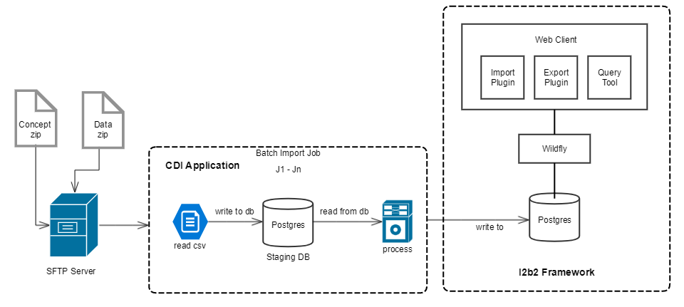

I2b2 CDI (Clinical Data Infrastructure) application allows users to imports patients data (like patient dimentions, encounters, providers and observation facts) and clinical concepts from csv files into i2b2. CDI provides simple and generic way to import bulk data. I2b2 framework provides data storage and querying the data with the help of clinical concepts (i.e. Ontology). CDI monitors remote directories in SFTP server and downloads files from those remote directories when it senses new files. Then it trigegrs batch job for each file arrived. Batch job reads csv file, process and writes to db. Csv file must have in given format (i.e. columns in same sequence). CDI uses intermediate (i.e. staging) database for error handling purpose.

I2b2 CDI consist of following components:

### I2b2 Framework

I2b2 is designed primarily for cohort identification, allowing users to perform an enterprise-wide search on a database to determine the existence of a set of patients meeting certain inclusion or exclusion criteria. The i2b2 framework is packaged with a query tool that allows the user to drag-and-drop search terms from a hierarchical ontology. Investigators can perform analysis on the cohort.

### SFTP Server

Sftp server consist of directories for concpet and data where CDI senses for zip files. Zip file has strict folder structure that user needs to follow. 

### Postgres Database

CDI uses this database as staging database for error handling.

### CDI Application

This application make uses above 3 components. It monitors for zip files on the sftp srever. When it senses file, File gets downloaded and trigger a batch job. Batch job reads csv file and imports the data to staging database. Then it reads data from staging database and process and finally writes to i2b2 database. CDI logs for error records into csv file and send back the log to the sftp folder for each upload.

## Architecture
Following architecture diagram is for import data.

