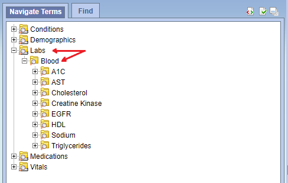
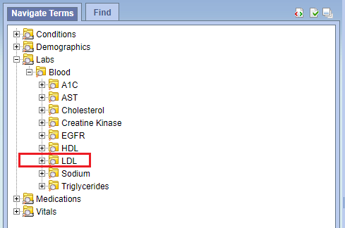
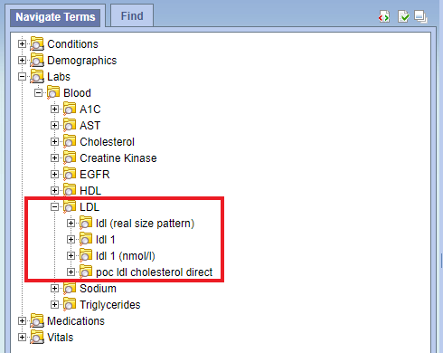

Below steps describes usage of CDI ( Clinical Data Infrastructure ) application i.e. understaing sftp folders, folder structure to be uploaded in concept and data folder, csv file structures, use cases etc. 

## Understanding SFTP Folders

Connect to SFTP server using using one of the client (e.g. `FileZilla` when using windows) by providing Host, Username, Password and Port.

1. **_Concept folder_** – Files in this folder will contain ontology data to be imported in i2b2. Files will be in csv format. File will have below folder structure.

```
├── ProjectID                           # (e.g. CONCEPT01)
│   ├── SourceSystemCD                  # (e.g. EDW)
│   │   ├── concepts.csv
│   |   ├── concept_mappings.csv
```

Finally zip the above folder as **_CONCEPT01.zip_** and append extra extension as **_CONCEPT01.zip.txt_**. (**_Note_**: This is required while uploading file to the sftp folder. After successful copy, Remove the extension)

2. **_Data folder_** – Files in this folder will contain patient data to be imported in i2b2. Files will be in csv format. File will have below folder structure.

```
├── ProjectID                           # (e.g. CONCEPT01)
│   ├── SourceSystemCD                  # (e.g. EDW)
│   │   ├── patient_dimensions.csv
│   |   ├── provider_dimensions.csv
│   │   ├── visit_dimensions.csv
│   |   ├── observation_facts.csv
```

Finally zip the above folder as **_DATA01.zip_** and append extra extension as **_DATA01.zip.txt_**. (**_Note_**: This is required while uploading file to the sftp folder. After successful copy, Remove the extension)

***

## Understanding files that will be uploaded in the concept folder

Create the below folder structure. ProjectID will be the first folder (e.g. CONCEPT01 , Note: Project Id can be alphanumeric ), inside it create another folder which represents SourceSystemCD (e.g. EDW). Finally create all or any of the csv file mentioned in below hierarchy.

```
├── ProjectID                           # (e.g. CONCEPT01)
│   ├── SourceSystemCD                  # (e.g. EDW)
│   │   ├── concepts.csv
│   |   ├── concept_mappings.csv
```

1. **concepts.csv**

| Index | 0 | 1 | 2 | 3 | 4 | 5 | 6 | 7 | 8 |
| --- | --- | --- | --- | --- | --- | --- | --- | --- | --- |
| **Column Name** | **Path*** | **Key*** | **Type*** | **MetadataXml** | **FactTableColumn** | **TableName** | **ColumnName** | **Operator** | **Dimcode** |
|e.g. | Labs | labs | T | | | | | | |
| | Labs/Blood | labs:blood | T | | | | | | |
| | Labs/Blood/LDL | blood:ldl | N | | | | | | |
( * ) indicates mandatory fields.

**Description:-**
* **_Path_**: A path that delineates the concept’s hierarchy. As shown in above table in Path column, while creating ontology, path hierarchy needs to be maintained. In the above example Labs is at the root level of the hierarchy followed by blood that will be the child element of Labs and LDL will be child element of the Blood and so on.
* **_Key_**: The Code i.e. concept that represent observation e.g. labs.  It is the unique code for the ontology as shown in above table in key column. In the above table, key and path is mandatory. Other index elements from 2-8 are optional. If value in the index 2-8 is not provided, then it takes the i2b2 default value.
* **_Type_**: Type is either ‘T’ for text or ‘N’ for numeric and describes the datatype of the concept.
* **_MetadataXml_**: i2b2 c_metadataxml in i2b2 table.
   For more details refer to https://community.i2b2.org/wiki/display/DevForum/Metadata+XML+for+Medication+Modifiers

* **_FactTableColumn_**: FactTableColumn is the name of the column in the fact table (observation_fact) that holds the concept code.
* **_TableName_**: TableName is the name of the lookup table that holds the concept code and concept path.
* **_ColumnName_**: ColumnName is the name of the field that holds the concept path.
* **_Operator_**: Operator is the SQL operator used in the WHERE clause of the SQL query. It is usually either ‘LIKE’ or ‘=’.
* **_DimCode_**: Dimcode is the path that lives in the dimension table and maps to the concept path.

***

2. **concept_mappings.csv**

| Index | 0 | 1 | 2 |
| --- | --- | --- | --- |
| **Column Name** | **StdCode*** | **LocalCode*** | **LocalCodeName*** |
| e.g. | LOINC&#124;2090-9 (For LDL) | PartnersEDW&#124;505435 | ldl 1 (nmol/l) |

( * ) indicates mandatory fields.

**Description:-**  This mapping file is required if someone wants to add their own sub-concepts to the standard concept.

* **_StdCode_**: This is standard LOINC code of the concept. This will be the parent of the local codes in the ontology. 
* **_LocalCode_**: These are the local codes for the particular standard concept. Local codes corresponding to this StdCode will be the child  concepts in the ontology.
* **_LocalCodeName_**: Name of the local code.

***

## Understanding files that will be uploaded in the data folder
Create the below folder structure. ProjectID will be the first folder (e.g. DATA01 , Note: Project Id can be alphanumeric ), inside it create another folder which represents SourceSystemCD (e.g. EDW). Finally create all or any of the csv file mentioned in below hierarchy.

```
├── ProjectID                           # (e.g. CONCEPT01)
│   ├── SourceSystemCD                  # (e.g. EDW)
│   │   ├── patient_dimensions.csv
│   |   ├── provider_dimensions.csv
│   │   ├── visit_dimensions.csv
│   |   ├── observation_facts.csv
```

1. **patient_dimensions.csv**

| Index | 0 | 1 | 2 |
| --- | --- | --- | --- |
| **Column Name** | **PatientID*** | **BirthDate** | **Gender** |
| e.g. | 112233 | 1961-11-16  00:00:00 | Male |
( * ) indicates mandatory fields.

**Description:-**
* **_PatientID_**: Unique Id for a patient.
* **_BirthDate_**: Birth date of a patient.
* **_Gender_**: Gender of a patient.

***

2. **provider_dimensions.csv**

| Index | 0 | 1 | 2 |
| --- | --- | --- | --- |
| **Column Name** | **ProviderID*** | **ProviderPath** | **UserNM** |
| e.g. | P12345 | /Intsitute1/dept1/JOHN M.D. | JOHN M.D. |
( * ) indicates mandatory fields.

**Description:-**
* **_ProviderID_**: Unique id of the provider.
* **_ProviderPath_**: The provider_path is the path that describes the how the provider fits into the institutional hierarchy.
* **_UserNM_**: Name of the provider.

***

3. **visit_dimensions.csv**

| Index | 0 | 1 | 2 | 3 |
| --- | --- | --- | --- | --- |
| **Column Name** | **PatientEncounterID*** | **PatientID*** | **StartDate** | **EndDate** |
| e.g. | 1111 | 12345 | 2018-10-08 | 2018-10-10 |
( * ) indicates mandatory fields.

**Description:-**
* **_PatientEncounterID_**: Encounter number for the PatientID.
* **_PatientID_**: Unique Id for a patient.
* **_StartDate_**: Start date of the observation.
* **_EndDate_**: End date of the observation

***

3. **observation_facts.csv**

| Index | 0 | 1 | 2 | 3 | 4 | 5 | 6 | 7 | 8 |
| --- | --- | --- | --- | --- | --- | --- | --- | --- | --- |
| **Column Name** | **EncounterID*** | **PatientID*** | **ConceptCD** | **ProviderID** | **StartDate*** | **ModifierCD** | **InstanceNum** | **Value** | **UnitCD** |
| e.g. | 1111 | 12345 | blood:ldl | 2222 | 2018-10-08 00:00:00 | @ | 1 | 120 | mg/dL |
( * ) indicates mandatory fields.

**Description:-**
* **_EncounterID_**: Encounter number for the PatientID  (this will be mapped to encounter num by the data loading module)
* **_PatientID_**: Unique id of the patient. (this will be mapped to patient num by the data loading module)
* **_ConceptCD_**: The Code i.e. concept that represent observation e.g. "labs".
* **_ProviderID_**: Unique id of the provider.
* **_StartDate_**: Start date of the observation. E.g. 2018-10-08 00:00:00.
* **_ModifierCD_**: If no value, default is @.
* **_InstanceNum_**:  If no value, default is 1.
* **_Value_**: Value of the observation. This can either be numeric or text. E.g. Value for "blood:ldl" is 120 i.e. numeric.
* **_UnitCD_**:  Unit of the observation. E.g. "mg/dL" for "blood:ldl".

***

## Use cases
This section explains about different use cases.

### Use Case 1: Import a new ontology into i2b2

* Create the below folder structure.
```
├── ProjectID                           # (e.g. CONCEPT01)
│   ├── SourceSystemCD                  # (e.g. EDW)
│   │   ├── concepts.csv
```
* Create concepts.csv. See concepts.csv section from [Understanding files in concept folder](../docs/i2b2-cdi-usage#understanding-files-that-will-be-uploaded-in-the-concept-folder)

Suppose you want to add new concept "LDL" under "Labs/Blood".

<kbd></kbd>

* **_Steps_**:-
   * **_Path_**: Add path like Labs/Blood/LDL. (If you want to add new concept called "Test" at root level just specify path like "Test". And further you can add sub concept below Test using "/" i.e. Forward Slash e.g. Test/Test1 )
   * **_Key_**: This will be used as unique concept code for your ontology. Here you are adding "LDL" under "Blood" So your key will be like "blood:ldl". Follow the same pattern for all ontology.
   * **_Type_**: Default is ‘T’ i.e. Text. In this case, ldl will be the numeric value so data type will be "N".

* So the concepts.csv will look like below,

   | **Path** | **Key** | **Type** | **MetadataXml** | **FactTableColumn** | **TableName** | **ColumnName** | **Operator** | **Dimcode** |
   | --- | --- | --- | --- | --- | --- | --- | --- | --- |
   | Labs/Blood/LDL | blood:ldl | N | | | | | | |

* If concept is at root level (i.e top level in hirarchy) then, refer the below csv.

   | **Path** | **Key** | **Type** | **MetadataXml** | **FactTableColumn** | **TableName** | **ColumnName** | **Operator** | **Dimcode** |
   | --- | --- | --- | --- | --- | --- | --- | --- | --- |
   | Labs | labs | T | | | | | | |

* Zip the folder and append extra extension ".txt" then upload the file to concept folder on sftp server.
* After successful file upload, Remove .txt extension. Application will process the file.
* Open i2b2 Web Client [ http://localhost/webclient ] to view your ontology and for running the query.
Your ontology will look like in below snapshot.
<kbd></kbd>

### Use Case 2: Import concept mappings

* Create the below folder structure.
```
├── ProjectID                           # (e.g. CONCEPT01)
│   ├── SourceSystemCD                  # (e.g. EDW)
│   │   ├── concept_mappings.csv
```

* Suppose you want to add sub-concepts ( using your own local codes and names ) to the concept "LDL".
* Create concept_mappings.csv. Refer to the section concept_mappings.csv from [Understanding files in concept folder](../docs/i2b2-cdi-usage#understanding-files-that-will-be-uploaded-in-the-concept-folder)
* So the concept_mappings.csv will look like below,
   | **StdCode** | **LocalCode** | **LocalCodeName** |
   | --- | --- | --- |
   | blood:ldl | ldl:505435 | ldl (real size pattern) |
   | blood:ldl | ldl:505436 | ldl 1 |
   | blood:ldl | ldl:505437 | ldl 1 (nmol/l) |
   | blood:ldl | ldl:505438 | poc ldl cholesterol direct |

* Zip the folder and append extra extension ".txt" then upload the file to concept folder on sftp server.
* After successful file upload, Remove .txt extension. Application will process the file.
* Open i2b2 Web Client [ http://localhost/webclient ] to view your ontology and for running the query.
Your ontology will look like in below snapshot.

<kbd></kbd>

### Use Case 3: Import facts for new concept

* Create the below folder structure.
```
├── ProjectID                           # (e.g. CONCEPT01)
│   ├── SourceSystemCD                  # (e.g. EDW)
│   |   ├── observation_facts.csv
```

* Suppose you want to add observation facts against **'blood:ldl'** concept that we have already added in previous use case. Create observation_facts.csv. Refer to the section observation_facts.csv from [Understanding files in data folder](../docs/i2b2-cdi-usage#understanding-files-that-will-be-uploaded-in-the-data-folder).
* So the observation_facts.csv will look like below,
   | **EncounterID*** | **PatientID*** | **ConceptCD** | **ProviderID** | **StartDate*** | **ModifierCD** | **InstanceNum** | **Value** | **UnitCD** |
   | --- | --- | --- | --- | --- | --- | --- | --- | --- |
   | 1111 | 12345 | blood:ldl | 2222 | 2018-10-08 00:00:00 | @ | 1 | 120 | mg/dL |

* If you want to add more information like demographics, providers and visits for the above fact, Then refer to the section patient_dimensions.csv, provider_dimensions.csv and visit_dimensions.csv respectively.
* Zip the folder and append extra extension ".txt" then upload the file to data folder on sftp server.
* After successful file upload, Remove .txt extension. Application will process the file.
* Open i2b2 Web Client [ http://localhost/webclient ] and run the query for LDL by dropping the ontology for LDL and check the results.


## License and Copyright
MPL 2.0 w/ HD  
See [LICENSE](LICENSE) file.  
See [HEALTHCARE DISCLAIMER](HD.md) file.  
© [Persistent Systems, Inc.](https://www.persistent.com)