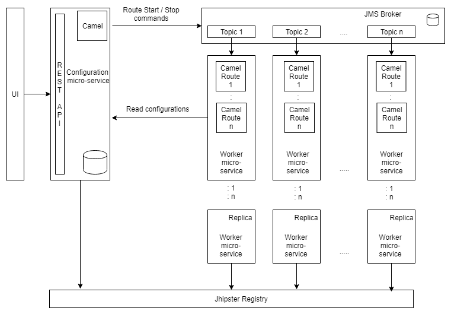
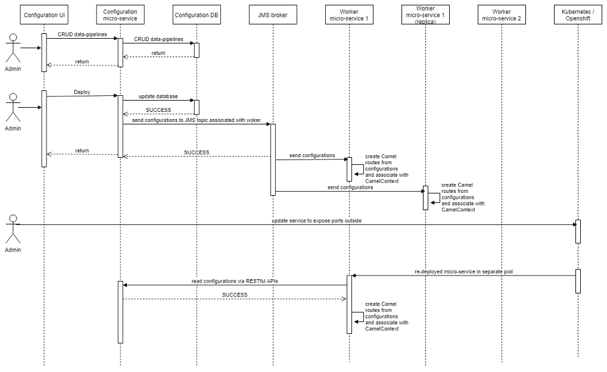

Integration App allows System Administrators to configure data integration pipelines for healthcare data via a user interface. Healthcare systems (e.g. EHR) can route, filter, and transform data over different protocols (e.g. MLLP, SFTP, HTTP, FILE.). It can provide integration for heterogeneous, high volume and/or time sensitive data following established integration patterns.

## Architecture

Integration App consists of following components:
### [Integration App](integration-app~README)  
Integration Application contain Integration UI along with Zuul filters(e.g. audit). It allows System Administrators to configure data pipelines for healthcare data via a user interface. 

### [Integration Configuration](integration-configuration~README) 
This service allows admin users to perform create, update, delete, deploy and undeploy data pipeline via RESTful api. Data pipeline configurations are stored in micro-service local database. This service supports following features: 
* Encryption / Decryption of Data pipeline properties like credentials to access secure endpoint.
* Versioning of Data pipeline configurations
* Import / Export of  Data pipeline configurations. Export will only export the last version.

### [Integration Worker](integration-worker~README) 
Data pipelines are deployed / undeployed using this micro-service. This micro-service is with apache camel integration. It binds Data Pipeline configurations and Camel context together. It is configured to listen to a JMS topic. It returns success / failure responses on a JMS queue. It will support following capabilities:
* Deploy action: Read Data Pipeline configurations (on JMS topic) and create a dynamic route consisting of Source and Destination endpoints, Processors (Filters, Transformers), Intermediate endpoints and associate the route with Camel context.
* Undeploy action: Gracefully unbind the Camel route from Camel context.
* Micro-service restart: Auto deploy data pipelines which are already in STRATED state.

## Sequence diagram
Following sequence diagram captures sequence of events on deployed environment:
