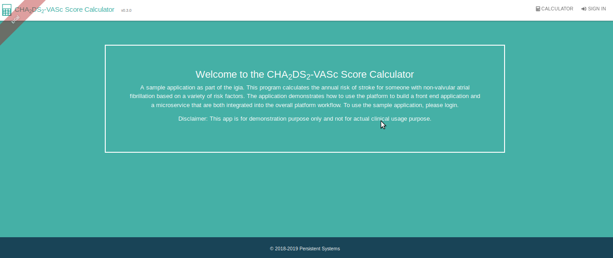
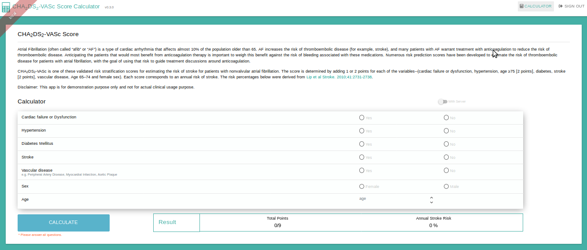
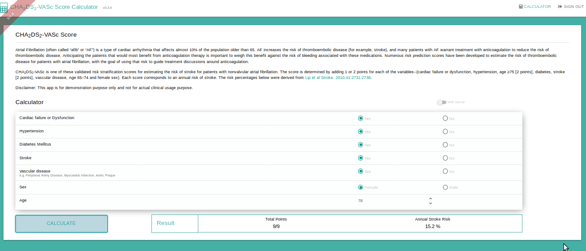

## Overview

[JHipster] [] generator is the recommended way to create a new clinical application. The generated application is a secure web application that serves as the application gateway.

The generated application leverages the [igia-keycloak] [] server for Authentication and Authorization. It can also easily access other <igia/> microservices.

Before using [JHipster] [] to generate a new application, it is strongly recommended that a user has familiarity with:
* Java and Spring Boot
* JHipster generator
* OAuth2/OpenID Connect
* Microservice architecture and "Backend for Frontend" development patterns

This document provides instructions on creating a new clinical application called igia-sample-app. An App is deployed to the <igia/> platform using [igia-orchestrator] [].

### Configure KeyCloak server

1. Login to [KeyCloak] [] as an administrator
2. create/import realm igia 
3. Create a new client 
4. Change client type to confidential

### Create a New User

igiademouser (in igia-sample-app 'admin' user is used)
add role (rolemapping for the user) and add the user in igia realm in [Keycloak] [].

### Generate application workspace and install JHipster@5.4.2

```
mkdir igiaworkspace
cd igiaworkspace
npm -g install generator-jhipster@5.4.2 
```

#### Update application configuration

1. modify application.yml, change realm name from jhipster to igia
2. update client id and secret from keycloak

## Create JHipster Sample Application microservice (cha2ds2vascapi)

This microservice gets the [CHA2DS2-VASc] [] parameter values as input to calculate the Stroke Risk %.
The process to create the api is explained as below.

1. Open the terminator from the folder where you want to create the microservice/project.
2. Type the command jhipster
```
mkdir cha2ds2vascapi
cd cha2ds2vascapi
jhipster
```
3. Installation script will ask (with sampleApp specific answers):
  - “Which type of application would you like to create?“
	ANS: Select 2nd option: Microservice application: in a microservices architecture, this is one of the services.
  - "What is the base name of your application?"
    ANS: cha2ds2vascapi
  - "As you are running in a microservice architecture, on which port would like your server to run? It      should be unique to avoid port conflicts. (8081)"
    ANS: 8054
  - "What is your default Java package name?"
    ANS: io.igia
  - "Which service discovery server do you want to use?"
    ANS: select 1st option - "JHipster Registry"
  - "Which type of authentication would you like to use?"
    ANS: select 2nd option - "OAuth 2.0 / OIDC Authentication"
  - "Which type of database would you like to use?"
    ANS: SQL
  - "Which production database would you like to use?"
    ANS: Postgres
  - "Which development database would you like to use?"
    ANS: H2, in-memory persistence
  - "Do you want to use the Spring cache abstraction?"
    ANS: Yes, with the Hazelcast implementation
  - "Do you want to use Hibernate 2nd level cache?"
    ANS: Y
  - "Would you like to use Maven or Gradle?"
    ANS: Maven
  - "Which other technologies would you like to use?"
    ANS: Nothing selected, Press Enter
  - "Would you like to enable internationalization support?"
    ANS: Y 
  - "Please choose the native language of the application"
    ANS: English
  - "Please choose additional languages to install"
    ANS: Spanish
  - "Besides JUnit and Jest, Which testing frameworks would you like to use?"
    ANS: Nothing Selected, Press Enter
  - "Would you like to install other generators from the JHipster Marketplace?"
    ANS: N
  
4. Push the code to the git repository as per your preference.

### Remove Database (Optional)
If you wish to remove the database from your project, then the below steps should be performed.
1. Modify database options in .yo-rc.json as follows:
```
"databaseType": "no",
"devDatabaseType": "no",
"prodDatabaseType": "no",
```
2. run jhipster. In this step choose 'overwrite' option for required files. Here all files are overwritten. 

3. Delete below files:
```
src/main/java/io/igia/config/DatabaseConfiguration.java
src/main/java/io/igia/config/audit/AuditEventConverter.java
src/main/java/io/igia/domain/AbstractAuditingEntity.java
src/main/java/io/igia/domain/PersistentAuditEvent.java
src/main/resources/config/liquibase folder 
```
Once you delete above files, check the files with errors and delete those.(Import the project in any IDE to check the errors).

These steps will regenerate the project removing the database files (so should be performed before development begins). Similar steps can be performed in the gateway as well.

### Install standalone profile for development

You can run the project in [standalone] [] mode where services like registry and keycloak are not needed. This can help in faster project development.
1. Open terminal from your project folder and type:
```
yarn global add generator-jhipster-standalone-profile
yo jhipster-standalone-profile
```
2. Several questions will be asked about overwriting some files in your project. Answer "yes" and complete the standalone profile creation.
3. Run the project with command
```
./mvnw -Pdev,standalone
```
4. Push the code to git.

### Start work on your requirements

1. Once the above commands are run successfully, a project structure will be created with all basic packages.
2. The following steps should be performed to create a sampleApp. Also refer [cha2ds2-vasc-api code] [] from github:
 - REST configuration: New rest configuration file added in package io.igia.web.rest to receive requests in JSON : "ChadsVascParameterResource.java"
 - Service : New Interface created in package io.igia.service to declare methods for actual calculation of cha2ds2vasc. : "RiskCalculatorService.java"
 - ServiceImpl: New package io.igia.service.impl created to add an implementation class for above service interface with business logic of stroke risk calculation : "RiskCalculatorServiceImpl.java"
 - Constants: added corresponding constants in Constants.java class.
 - BEANs/ DTOs: BEANs/ DTOs created to receive json request and send json response in package io.igia.service.dto : "ChadsVascParameterDTO.java", "ResultDTO.java"
 - Exception & Error: Used JHipster customized exception class "CustomParameterizedException.java" to throw an exception and added new Errors in "ErrorConstants.java"
 - update the application.yml as mentioned above in 'update application configuration' step. Refer the [application.yml in cha2ds2-vasc-api] [].
 
3. Run the application in standalone with command:
```
./mvnw -Pdev,standalone
```
4. To test the API, prepare the POST request and send it through Postman (or other REST software):
```
URL : http://localhost:8054/api/risk-score

Method : POST

Request :

{
               "congestiveHeartFailure" :true,
                "hypertension":true,
                "diabetesMellitus":true,
                "priorStroke":true,
                "vascularDisease":true,
                "age":77,
                "sexCategory":"Female"
}

Response :

{
    "totalPoint": 9,
    "strokeRiskPercent": 15.2
}

```
5. Push the changes to git. 

### Run Application in development mode

To run the microservice without a standalone profile we need to start the below services:

1. [JHipster registry] []
2. [Keycloak] []

once the above services are started, then run the below command in terminator from cha2ds2vascapi folder:

```
./mvnw
```

### Adding tests
1. Add Unit and Integration tests
The sample application includes 2 sample tests. Refer [cha2ds2-vasc-api test] []:
- Test for rest : ChadsVascParameterResourceIntTest.java
- Test for service class : RiskCalculatorServiceTest added to mock calculate method.

Run the command below for Unit and Integration tests:
```
./mvnw test 
```

2. Adding Karate tests
Karate is an open-source tool that combines API test-automation, mocks and performance-testing into a single, unified framework. Refer [cha2ds2-vasc-api karate] [].
Use the below steps to enable Karate:
1. Add below dependencies in POM.xml
```
<dependency>
    <groupId>com.intuit.karate</groupId>
    <artifactId>karate-apache</artifactId>
    <version>0.8.0</version>
    <scope>test</scope>
</dependency>
<dependency>
    <groupId>com.intuit.karate</groupId>
    <artifactId>karate-junit4</artifactId>
    <version>0.8.0</version>
    <scope>test</scope>
</dependency>
```
2. Add below execution in plugin 'maven-surefire-plugin' in POM.xml
```
<executions>
  <execution>
      <id>default-test</id>
      <configuration>
          <excludes>
              <exclude>**/Abstract*.java</exclude>
              <exclude>**/*Karate*.java</exclude>
          </excludes>
      </configuration>
  </execution>
</executions>
```					
3. Add Profile in POM.xml
```
<profile>
    <id>integration</id>
    <build>
        <plugins>
            <plugin>
                <groupId>org.apache.maven.plugins</groupId>
                <artifactId>maven-surefire-plugin</artifactId>
                <version>${maven-surefire-plugin.version}</version>
                <executions>
                    <execution>
                        <id>Karate integration tests</id>
                        <goals>
                            <goal>test</goal>
                        </goals>
                        <configuration>
                            <includes>
                                <include>**/*Karate*.java</include>
                            </includes>
                        </configuration>
                    </execution>
                </executions>
                <configuration>
        <!-- Force alphabetical order to have a reproducible build -->
                    <runOrder>alphabetical</runOrder>
                </configuration>
            </plugin>
        </plugins>
    </build>
</profile>
```
4. create features folder in src/test
5. create file basic-auth.js
```
function(credentials) {
  var temp = credentials.username + ':' + credentials.password;
  var Base64 = Java.type('java.util.Base64');
  var encoded = Base64.getEncoder().encodeToString(temp.bytes);
  return 'Basic ' + encoded;
}
```
6. create karate-config.js and modify your baseURL and tokenURL
```
function() {
  var env = karate.env;
  karate.log('karate.env system property was:', env);
  if (!env) {
    env = 'dev';
  }
  var config = {
    baseUrl: 'http://localhost:8054/api',
    tokenUrl: 'http://localhost:9080/auth/realms/igia/protocol/openid-connect/token',
    clientId: 'internal',
    clientSecret: 'internal'
  };

  karate.configure('connectTimeout', 50000);
  karate.configure('readTimeout', 50000);
  karate.configure('logPrettyRequest', true);
  return config;
}
```
7. create folder inside src/test/features folder. (cha2ds2vasc)
8. Add KarateTestRunner.java class in src/test/java. provide above folder name as classpath.
```
@RunWith(Karate.class)
@CucumberOptions(features = "classpath:cha2ds2vasc")
public class KarateTestRunner {
}
``` 
9. create test files login.feature and cha2ds2vascapi.feature inside the folder above.
10. To run the Karate tests, keep the server running with keycloak and jhipster-registry and run below command in separate terminator:
```
./mvnw test -Dtest=KarateTestRunner
```

### Swagger-UI for API
JHipster uses "Swagger" to provide a UI to all available APIs in development environment:
To use swagger, follow the below steps:
- Install a browser specific plugin for swagger (ex: for chrome, swagger UI Console plugin is provided)
- Open the plugin and expose the link "http://localhost:8054/v2/api-docs 
- All available APIs will be listed.
	
## Create Gateway application (CHA2DS2-VASc app)

The below steps are used to create a sample application. This application will help to calculate risk of stroke for patients with non-valuable atrial fibrillation using the [CHA2DS2-VASc][] risk score.

#### Generate Gateway application

1. Open CMD/Terminal and run the following commands:

```
mkdir cha2ds2vascapplication
cd cha2ds2vascapplication
jhipster --jhi-prefix="igia"
```

JHipster will ask below questions to generate an application. (with sampleApp specific answers)

  1. “Which type of application would you like to create?“
	ANS: Select 3rd option: Microservice gateway
  2. "What is the base name of your application?"
	ANS: cha2ds2vascapplication
  3. "As you are running in a microservice architecture, on which port would like your server to run? It should be unique to avoid port conflicts. (8080)"
  ANS: 8055
  4. "What is your default Java package name?"
  ANS: io.igia
  5. "Which service discovery server do you want to use?"
  ANS: JHipster Registry
  6. "Which *type* of authentication would you like to use?"
  ANS: OAuth 2.0 / OIDC Authentication
  7. "Which *type* of database would you like to use?"
  ANS: SQL
  8. "Which production database would you like to use?"
  ANS: Postgres
  9. "Which development database would you like to use?"
  ANS: H2, in-memory persistence
  10. "Do you want to use Hibernate 2nd level cache?"
  ANS: Y
  11. "Would you like to use Maven or Gradle?"
  ANS: Maven
  12. "Which other technologies would you like to use?"
  ANS: Nothing selected, Press Enter
  13. "Which Framework would you like to use for the client?"
	ANS: Angular 6
  14. "Would you like to use the Sass stylesheet preprocessor for your CSS?"
	ANS: yes
  15. "Would you like to enable internationalization support?"
  ANS: Y
  16. "Please choose the native language of the application"
  ANS: English
  17. "Please choose additional languages to install"
  ANS: Spanish
  18. "Besides JUnit and Jest, which testing frameworks would you like to use?"
  ANS: Cucumber and Protractor
  19. "Would you like to install other generators from the JHipster Marketplace?"
  ANS: N


2. Install a standalone profile for development

This module helps run the application without a registry or Auth server. On the front-end side this module also helps to use in-memory-api. [generator-jhipster-standalone-profile][].

```
yarn global add generator-jhipster-standalone-profile
yo jhipster-standalone-profile
```
It will ask whether to add a standalone profile to the server as well as client code. Select yes and proceed. It will also ask to override certain file(s). Select yes and proceed. 

3. Run the app using standalone mode
```
yarn start:standalone
```

### Steps for updating UI application

1. Create a new component in angular app

	Angular-cli commands can be used to generate a new component. [Using Angular in JHipster][]. 

	Created folder(calculator) in [cha2ds2vascapp\src\main\webapp\app](https://github.com/igia/cha2ds2-vasc-application/tree/master/src/main/webapp/app)

	Added below files in calculator folder
	- calculator.component.ts
	- calculator.component.html
	- calculator.scss
	- cha2ds2vasc.service.ts
	- calculator.module.ts
	- calculator.route.ts
    - index.ts

2. Add appropriate code in the above files
3. Update ts file app.module to import new calculator module.  
4. Update Navbar and Footer styles

	- Goto src\main\webapp\app\layouts\footer and update style as required
	- Goto src\main\webapp\app\layouts\navbar and update styles as required
	
5. Unit test is added in src\test\javascript\spec\app\calculator folder. 
	- To run unit tests below commands is used
	```
	yarn test
	```
### Update UI style and remove unused code (Optional step)

1. Add bootstrap library for styling UI [bootstrap-material-design][].
2. Suggestion to remove unused UI pages/files from the JHipster generated code. (swagger-ui, administration related pages etc). 
3. Update the colour schemes and logo/icons as per required UI style (Specific to your platform).

### Steps for adding auditing capabilities

The application gateway serves as the backend for the clinical application. It is necessary to add HIPAA auditing capabilities so that all of the API calls are logged/auditable. <igia/> provides a Spring Boot auto-configuration library for this purpose. To add the HIPAA auditing library into the project, just add the following lines to the pom.xml, right after `<!-- jhipster-needle-maven-add-dependency -->`

> Please use 0.3.0 for version before <igia/> is released.

```
        <dependency>
            <groupId>io.igia</groupId>
            <artifactId>igia-hipaa-audit-autoconfig</artifactId>
            <version>0.3.0</version>
        </dependency>
```

Please refer to the [igia-commons README](https://github.com/igia/igia-commons/blob/master/README.md) file for more information about the library.

### Steps for updating client id of the application (For keycloak)

When generating a gateway application, [JHipster] [] sets the client id as 'web_app'. To update this client id, the below changes are required.

1. Change values under security.oauth2.client in application.yml file in main and test folder. Refer [application.yml in cha2ds2-vasc-application] [].
2. Add respective client in Keycloak with roles and users.

### Run Application in development mode

To run the gateway application without a standalone profile we need to start the below services:

1. [JHipster registry] []
2. [Keycloak] []
3. cha2ds2-vasc-api microservice

once the above services are started, then run the below commands in separate terminators from gateway folder:

```
./mvnw

yarn start
```
Home


Calculator


Calculator Result


[JHipster]: https://www.jhipster.tech/
[igia-keycloak]: https://github.com/igia/igia-keycloak
[CHA2DS2-VASc]: https://en.wikipedia.org/wiki/CHA2DS2%E2%80%93VASc_score
[cha2ds2-vasc-api]: https://github.com/igia/cha2ds2-vasc-api
[standalone]: https://www.npmjs.com/package/generator-jhipster-standalone-profile
[cha2ds2-vasc-api code]: https://github.com/igia/cha2ds2-vasc-api/tree/master/src/main
[cha2ds2-vasc-api test]: https://github.com/igia/cha2ds2-vasc-api/tree/master/src/test
[cha2ds2-vasc-api karate]: https://github.com/igia/cha2ds2-vasc-api/tree/master/src/test/features
[Using Angular in JHipster]: https://www.jhipster.tech/using-angular/
[igia-orchestrator]: https://github.com/igia/igia-orchestrator/blob/master/README.md
[Keycloak]: https://www.keycloak.org/docs/latest/getting_started/index.html
[JHipster registry]: https://www.jhipster.tech/jhipster-registry/
[application.yml in cha2ds2-vasc-api]: https://github.com/igia/cha2ds2-vasc-api/blob/master/src/main/resources/config/application.yml 
[application.yml in cha2ds2-vasc-application]: https://github.com/igia/cha2ds2-vasc-application/blob/master/src/main/resources/config/application.yml
[generator-jhipster-standalone-profile]: https://www.npmjs.com/package/generator-jhipster-standalone-profile
[bootstrap-material-design]: https://fezvrasta.github.io/bootstrap-material-design/
